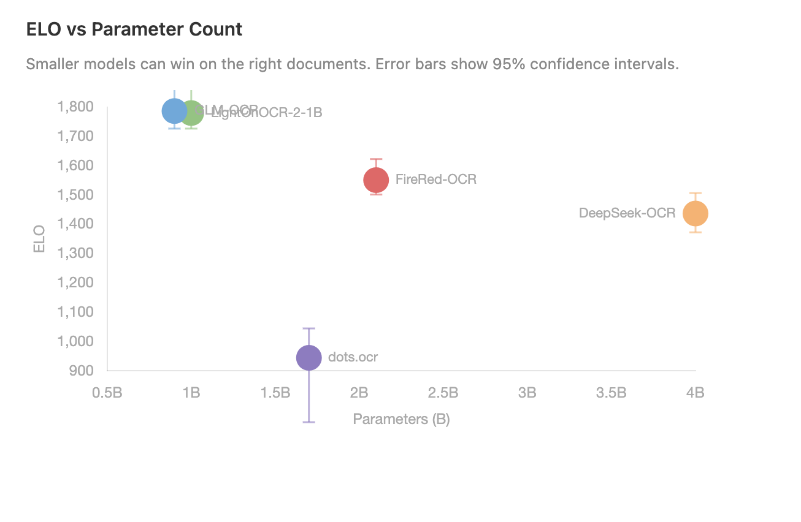
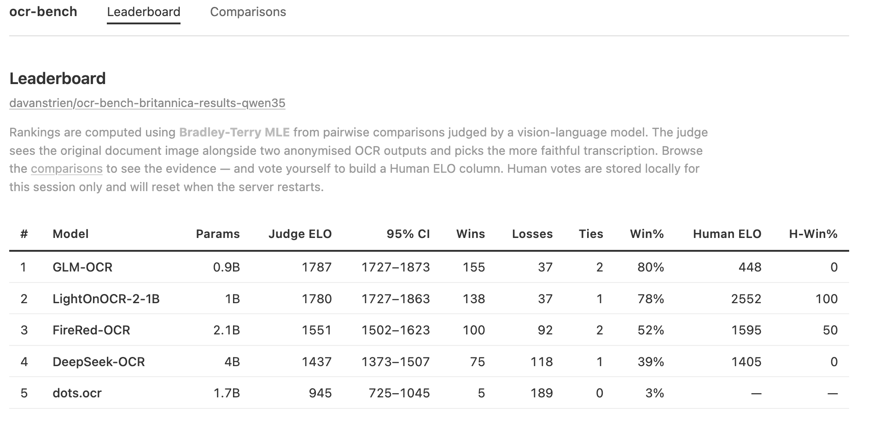

# ocr-bench

**There is currently no single best OCR model.** Rankings change depending on your documents. Manuscript cards, printed books, historical texts all produce different winners.

`ocr-bench` allows you to create **per-collection leaderboards** using a VLM-as-judge approach, so you can find what works best for _your_ documents rather than relying on generic benchmarks. You can validate the VLM's judgement with human votes, and share results via the Hugging Face Hub.

The underlying OCR model inference uv scripts are available at [uv-scripts/ocr](https://huggingface.co/datasets/uv-scripts/ocr). The majority of these use vLLM for efficient GPU inference, and are designed to run on a single consumer GPU (e.g. 24GB 3090/4090). The `ocr-bench` package orchestrates running these models at scale on the Hub, and judging outputs with a VLM. If you just want to run some OCR models on your data without the judging/leaderboard aspect, you can run the scripts directly.

## Why?

Generic OCR benchmarks tell you which model wins _on average_. But if you're digitising 18th-century encyclopaedias, that average doesn't help — the best model for your documents might be the worst on someone else's.

ocr-bench lets you run the same set of OCR models on a sample of _your_ collection, then uses a vision-language model to judge which produces the best transcription for each document. The result is a leaderboard specific to your data.

| Model              | BPL card catalog | Britannica 1771 |
| ------------------ | :--------------: | :-------------: |
| GLM-OCR (0.9B)     |    #2 (1535)     |  **#1** (1787)  |
| LightOnOCR-2 (1B)  |  **#1** (1559)   |    #2 (1780)    |
| FireRed-OCR (2.1B) |        —         |    #3 (1551)    |
| DeepSeek-OCR (4B)  |    #4 (1452)     |    #4 (1437)    |
| dots.ocr (1.7B)    |    #3 (1453)     |    #5 (945)     |

Rankings can flip completely between collections.



## Hub-native by design

The entire evaluation loop lives on the Hugging Face Hub:

1. **Your dataset** on the Hub (images + optional ground truth)
2. **OCR models** run via [HF Jobs](https://huggingface.co/docs/hub/jobs-overview) → outputs written as PRs on a Hub dataset
3. **VLM judge** via [HF Inference Providers](https://huggingface.co/docs/inference-providers/index) — only needs an HF token
4. **Results** published to a Hub dataset (leaderboard + pairwise comparisons)
5. **Viewer** as a [HF Space](https://huggingface.co/spaces) for browsing and human validation

No local GPU required. Everything is shareable via Hub URLs.

## Quickstart

```bash
uv pip install ocr-bench[viewer]

# 1. Run OCR models on your dataset
ocr-bench run <input-dataset> <output-repo> --max-samples 50

# 2. Judge outputs pairwise with a VLM
ocr-bench judge <output-repo>

# 3. Browse results + validate
ocr-bench view <output-repo>-results
```

## How it works

**`ocr-bench run`** launches OCR models on your dataset via [HF Jobs](https://huggingface.co/docs/hub/jobs-overview). Each model writes its output as a PR on the same Hub dataset, keeping everything together without merge conflicts.

**`ocr-bench judge`** runs pairwise comparisons using a VLM judge (default: [Qwen3.5-35B-A3B](https://huggingface.co/Qwen/Qwen3.5-35B-A3B) via HF Inference Providers). For each document, the judge sees the original image and two OCR outputs (anonymised as A/B) and picks the better transcription. Results are fit to a [Bradley-Terry model](https://en.wikipedia.org/wiki/Bradley%E2%80%93Terry_model) to produce ELO ratings with bootstrap 95% confidence intervals. Adaptive stopping halts early when rankings are statistically resolved.

**`ocr-bench view`** serves a local web viewer with a leaderboard, comparison browser, and human validation. Vote on comparisons to cross-check the automated judge with human judgement.

## Available models

ocr-bench ships with 5 OCR models ready to run:

| Model           | Size | Best for                   | Notes                        |
| --------------- | ---- | -------------------------- | ---------------------------- |
| `glm-ocr`       | 0.9B | Historical printed text    | Top performer on Britannica  |
| `lighton-ocr-2` | 1B   | Card catalogs, manuscripts | Top performer on BPL         |
| `firered-ocr`   | 2.1B | Clean printed text         | Mid-pack on degraded docs    |
| `deepseek-ocr`  | 4B   | Diverse documents          | Most consistent across types |
| `dots-ocr`      | 1.7B | General                    | Struggles on historical text |

All model scripts are available at [uv-scripts/ocr](https://huggingface.co/datasets/uv-scripts/ocr) on the Hub.

By default all 5 run. To pick specific models:

```bash
ocr-bench run <dataset> <output> --models glm-ocr lighton-ocr-2
```

## Example results



Browse these on the Hub:

- [davanstrien/ocr-bench-britannica-results-qwen35](https://huggingface.co/datasets/davanstrien/ocr-bench-britannica-results-qwen35) — Encyclopaedia Britannica 1771, 5 models, 50 samples
- [davanstrien/bpl-ocr-bench-results](https://huggingface.co/datasets/davanstrien/bpl-ocr-bench-results) — Boston Public Library card catalog, 4 models, 150 samples
- [Live viewer](https://huggingface.co/spaces/davanstrien/ocr-bench-britannica-results-qwen35-viewer) — Britannica leaderboard with ELO chart and comparison browser

## Install

```bash
uv pip install ocr-bench            # Core (run + judge)
uv pip install ocr-bench[viewer]    # With web UI
```

Or with [uv](https://docs.astral.sh/uv/):

```bash
uv pip install ocr-bench[viewer]
```

Requires Python >= 3.11 and an [HF token](https://huggingface.co/settings/tokens).

## Status

Working proof of concept. The core pipeline (run → judge → view) is functional. Not polished production software — expect rough edges. This is an early-stage project to explore the idea of VLM-judged OCR leaderboards, and gather feedback on the concept and implementation!
